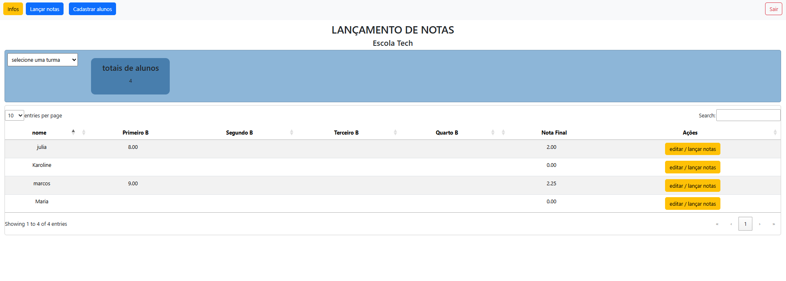

# 🎓 Projeto Escola

## 📌 Status do Projeto
🚧 Em desenvolvimento

## 📝 Sobre o Projeto

O Projeto Escola é uma aplicação voltada para a gestão de alunos e notas, oferecendo um ambiente seguro e intuitivo para usuários autenticados.

Funcionalidades principais:

🔐 Autenticação de usuários com opção de login e cadastro

🛡️ Criptografia de senha, garantindo maior segurança dos dados

👨‍🎓 Cadastro de novos alunos

🧾 Lançamento e gerenciamento de notas

🔄 Redirecionamento automático após autenticação bem-sucedida

Após realizar o login, o usuário é direcionado para um painel administrativo onde poderá adicionar alunos e registrar suas respectivas notas de forma prática e organizada.

## TECNOLOGIAS UTILIZADAS
## Front-end
- HTML5 (integrado aos arquivos PHP)
- CSS3
- Bootstrap
- JavaScript
- jQuery

## Back-end
- PHP
- MySQL

